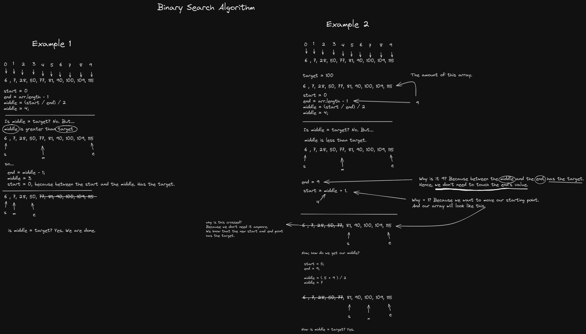

# Binary Search

One of the **ABCs** of DSA.

**Binary Search** is a searching algorithm where it will find the target by recursively cutting the array in half and keeping the index on the middle until it finds it.

When the target is less than the middle index's value, it will ignore or cut the array on the right.

But when the target is greater than the middle index's value, it will ignore or cut the array on the left.

_English is not my first language btw_

Enough of that, here's an image on how I solved by using Excalidraw! It's like the digital pen and paper.

I hope I said that right, please make a pull request if I ever had mistakes at my grammar and code. Your time will be appreciated!
