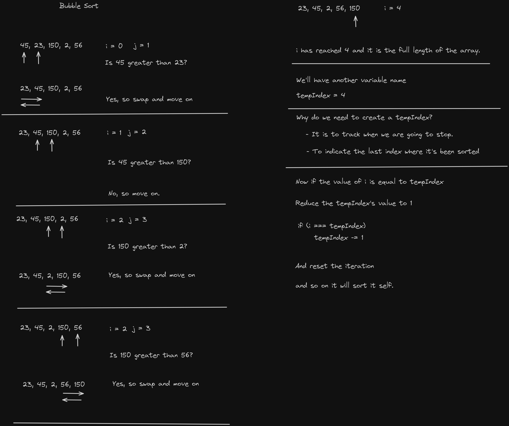

# Bubble Sort

Bubble Sort is a simple sorting algorithm that checks through the array or list and compares adjacent elements, and swap them if they are in the wrong order.

This will continue until it will be sorted

Here's how solved it by using Excalidraw

