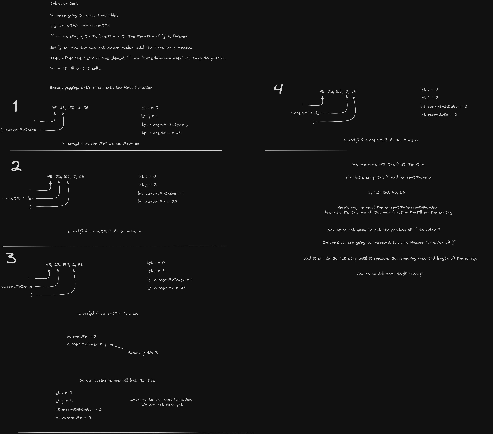

# Selection Sort

Selection sort is also a simple sorting algorithm that sorts the unsorted region of the array. It will repeatedly selects the smallest element from the unsorted region and swaps it with the first unsorted region.

Here's how solved it by using Excalidraw

