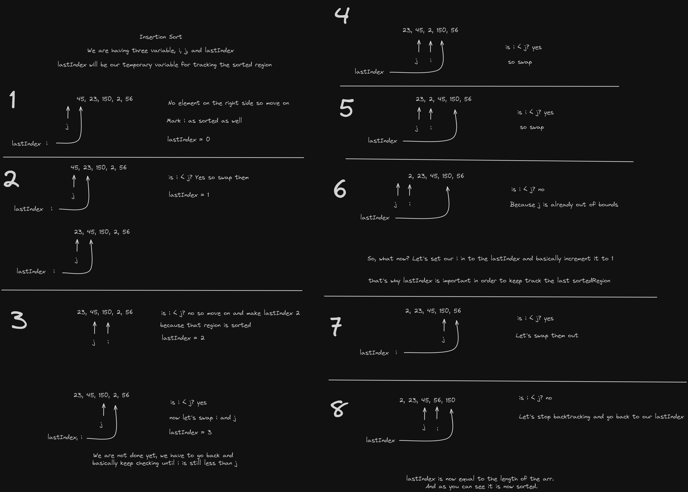

# Insertion Sort

**Insertion Sort** is a simple and intuitive comparison-based sorting algorithm. It builds the final sorted array one item at a time by repeatedly taking the next unsorted item and inserting it into its correct position within the already sorted portion of the array.

Here's how solved it by using Excalidraw

