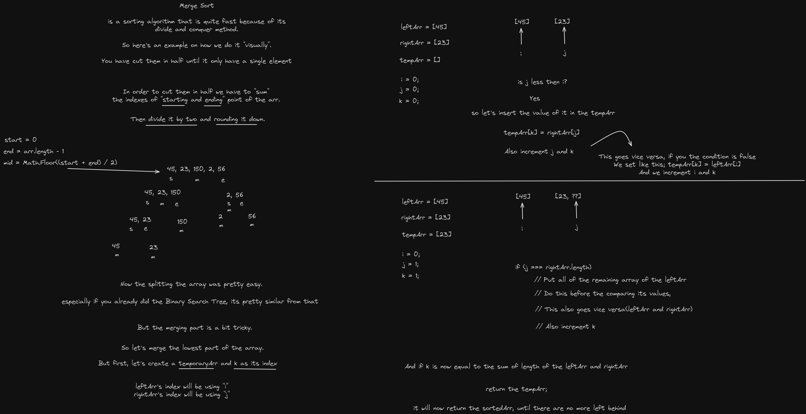

# Merge Sort

I did this long time ago but I didn't fully understand it. But now, I do.

**Merge sort** is a sorting algorith that is highly efficient by using **divide-and-conquer**. It works by dividing the unsorted list into smaller sublists until each sublist contains a single element (which is trivially sorted). Then, it repeatedly merges these sublists to produce new sorted sublists until there is only one sorted list remaining, which is the sorted array.

Here's how solved it by using Excalidraw

