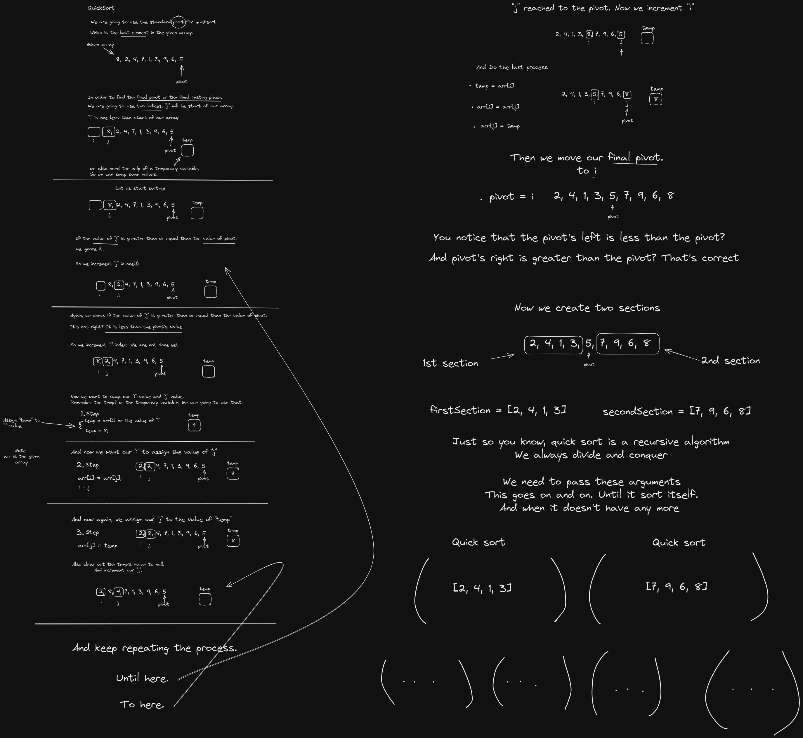

# Quick Sort

**Quick Sort** is a highly efficient and commonly used sorting algorithm that employs a divide-and-conquer strategy to sort elements. It works by selecting a 'pivot' element from the array and partitioning the other elements into two sub-arrays, according to whether they are less than or greater than the pivot. The sub-arrays are then sorted recursively.

This is quite long but I like how it process.

