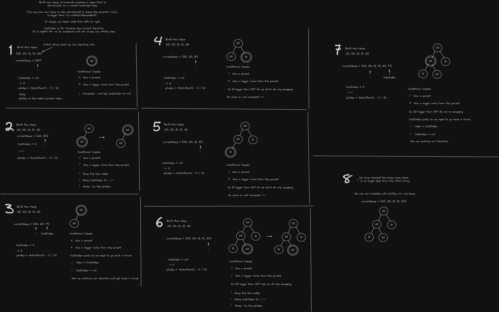

# Heaps

A heap is a binary-tree structured data that satisfies the heap property.

There are two types of heaps, a **max-heap** and a **min-heap**.

- A **max-heap** is where the parent is **greater than** its children.

- A **min-heap** however is where the parent is **less than** its children.

A heap is basically an **almost complete/balanced binary-tree** tree because a parent can have one or two children.

In heap we can also have functions like;

- Heapify _(Min/Max Heap)_

  - It is a function where it recursively satisfies the heap property.
  - When we do a heapify we have two approaches an **up-buttom** and **bottom-up approach**, It could also either do a min or max heap version of this.

- Build _(Min/Max Heap)_

  - When we are building a heap, we do a **up approach** or **bottom-up approach**, where after inserting each node we put in the heap, we have to check the inserted node if it is bigger (max-heap) or smaller (min-heap) than the parent.

- Insert

  - Every time we insert a node, we have to call **heapify** in order to _satisfy_ the heap property.
  - We do a heapify that does a **bottom-up approach**. The reason why is that after insertion, we put our node in next to the last. And now that new node have to find its **way through up** and find where he is supposed to be on.

- Delete

  - When it comes to deleting, we delete the prioritized node, and it's always at the top. So we first **swap the first and last node value**. Then **delete the last node** or basically the **prioritized node**.

  - We do a heapify that does a **up-bottom approach**. The reason why is that after the deletion, we are not satisfying the heap property. And now the new root node have to **through down** and find where he is supposed to be on.

- Sort
  - When it comes to sorting, whenever we delete a node in a heap or preferably a max-heap. We get to delete prioritized node right?
  - So, in heap sort. We iterate to the heap and get the prioritized node that's been deleted. And of course every deletion will basically do a heapify in order to satisfy the heap.

### Note

This was long, but I did every function for 5 hours, I'm only showing the build max heap, and this will do a bottom-up approach on excalidraw.

After doing this through pen-paper and code, I've easily done the every heap function because they are almost similar with a little tweaking.

