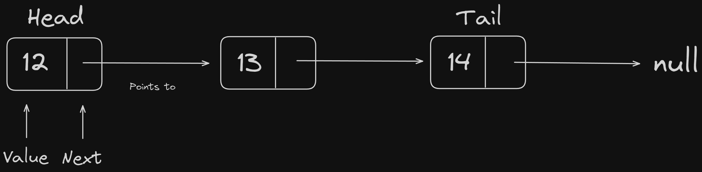

# Linked List

A linked list is a linear data structure that consists of a series of **nodes** that is connected by pointers.

Here's an example of a single linked list.

The **head** is the first node and the **tail** is the last node.

### Note

The implementation of the code wasn't that hard at all especially if you already know how to use recursion, but you can also use loops for traversing through the list.

I've research through the internet about the differences between array and linked list, specifically the memory and performance.

They both have their trade-offs, but it entirely depends on what use case you want to do.

- Access Time

  - Arrays have faster access time by having O(1) time complexity since all the elements are in the contiguous memory.

  - However for linked list it would be O(n) due to starting the access time from the start to the desired index.

- Insertion/Deletion

  - On this operation, especially in the middle index of the array. You'll be having an O(n) time complexity due to the elements need to be shifted to accomodate the change.

  - For the linked list, it would be O(1) especially at the beginning of the list. Because you only need to create or reassign the values. But, the finding the desired index for this operation can take O(n) time.
