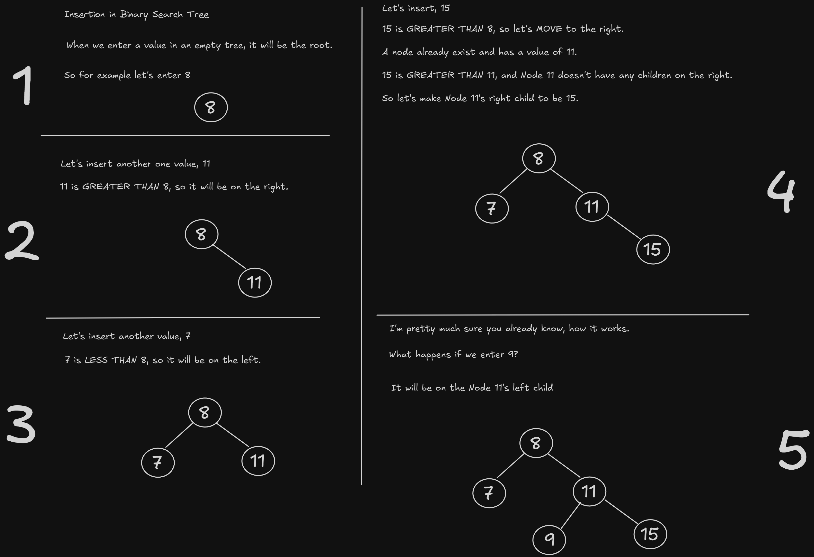
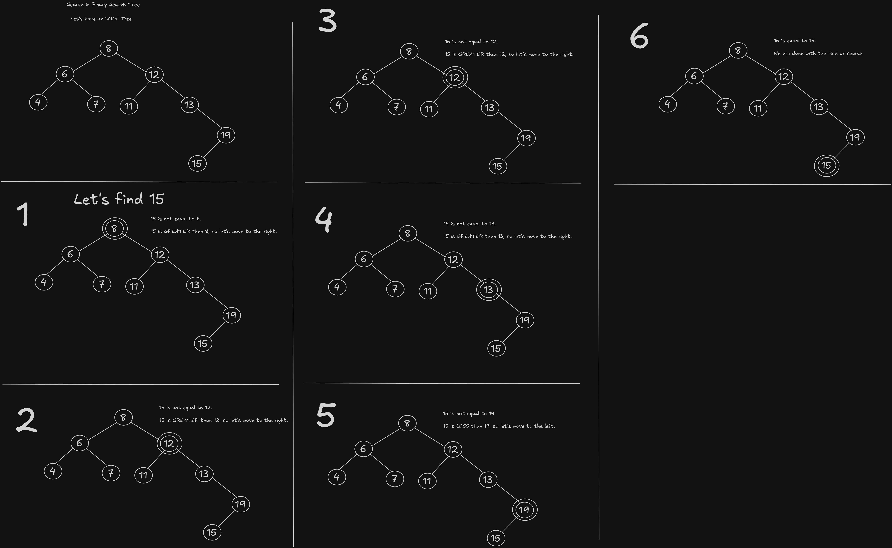
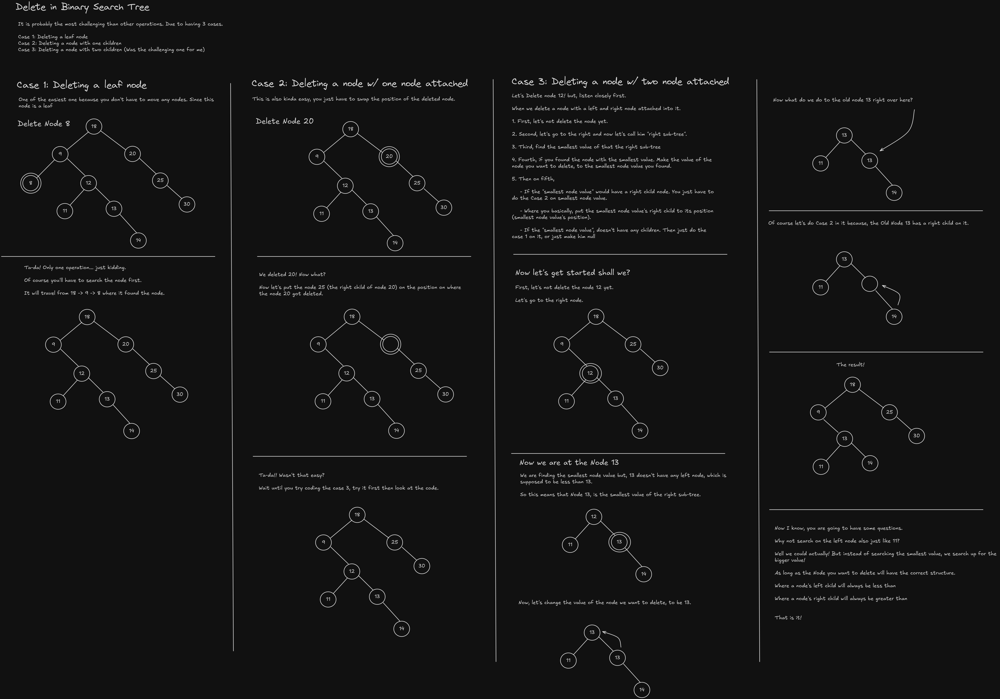

# Binary Search Tree

A Binary Search Tree is a non-linear data structure that stores nodes in a specific order for efficient operations like insertion, deletion, searching, and etc...

### Node in BST

A node contains a left reference (left node / left child) and right reference (right node / right child) and a data element which is typically in number.

In every **node**, they can have:

- A child node attached into them, it contains left child and right child.
- It could also have one child, and no children. We call it a _leaf node_.

- If a node has a left node, it means that the **left node's value** is **less than** the node.

- If a node has a right node, it means that the **right node's value** is **greather than** the node.

### Operations

- **Insertion**

  - Inserting a node in an existing binary tree, it will recursively find the specific order to place it.

  - If you insert in an empty tree, it will make itself as the root node.

  

- **Searching**

  - Searching a node in binary tree can be efficient due to its structure, especially
    if the tree is **balanced**.

  - This is also a recursive function.

  

- **Deletion**

  - Deleting a node in binary tree can be also efficient because it only requires minimal operations to do so.

  - But, it is also one of the trickiest one to code, for me.

  

### Traversals

- **Level Order**

  - A level order traversal is basically **BFS or Breadth First Search**. Where it access nodes level by level.

  - Pattern for this in Binary Search Tree is to print out a the nodes left to right in every level.

- **In order**

  - This traversal visits the left node first, then the current node, and finally the right node.

  - Pattern for this is [ Left -> Visit -> Right ]

- **Pre order**

  - This traversal visits the current node first, then the left node, and finally the right node.

  - Pattern for this is [ Visit -> Left -> Right ]

- **Post order**

  - This traversal visits the left node first, then the right node, and finally the current node.

  - Pattern for this is [Left -> Right -> Visit]
