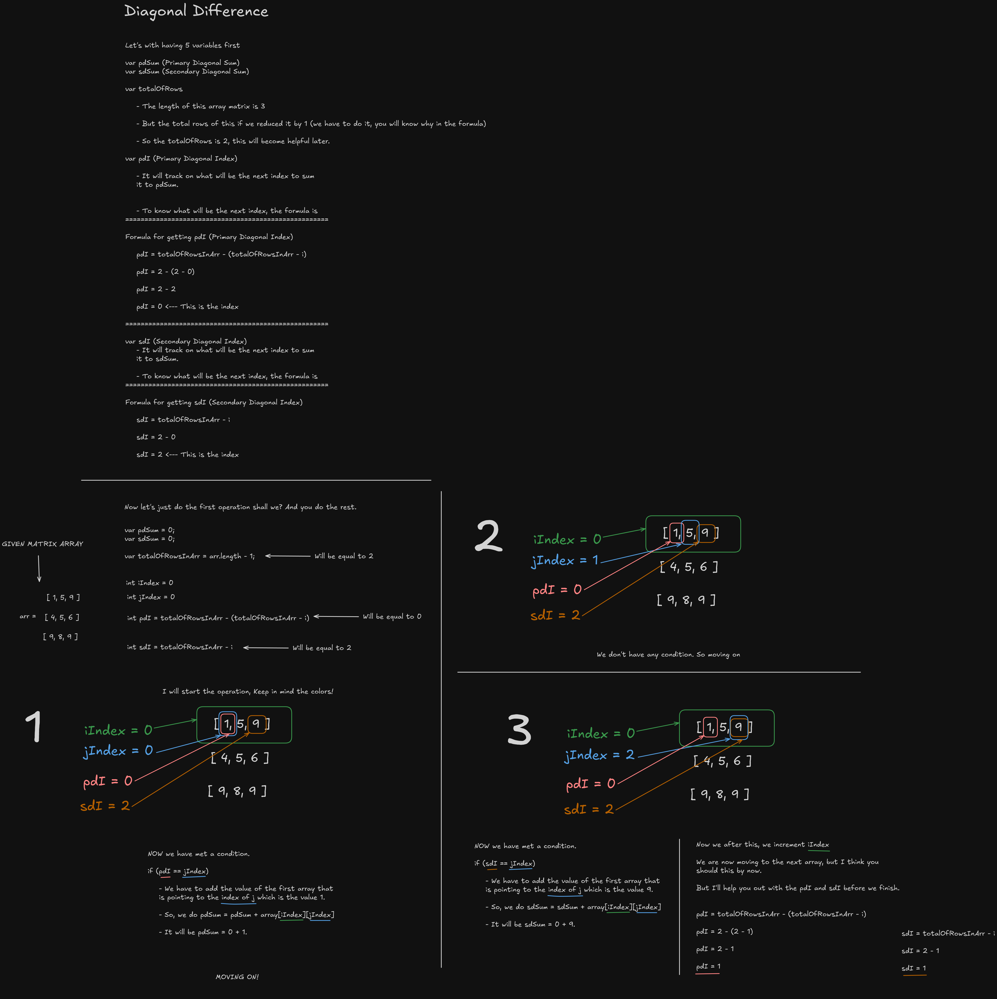

# Diagonal Difference

This is just an easy coding problem in HackerRank. Where you have sum the diagonal index of an array matrix and return the absolute difference between the sums.

We have the **Primary Diagonal** and **Secondary Diagonal**.

For example have an array matrix of

[1 2 3]  
[4 5 6]  
[9 8 9]

The primary diagonal will be

[1, #, #]  
[#, 5, #]  
[#, #, 9]

1 + 5 + 9

the Sum of the Primary Diagonal will be **15**

The secondary diagonal will be

[#, #, 3]  
[#, 5, #]  
[9, #, #]

3 + 5 + 9

the Sum of the Secondary Diagonal will be **17**

Now what will be absolute difference?

15 - 17 = 2

 

Here's the full explaination, if you want to know more.

### Note

I know this might be something unexpected. The reason why is that, I am just
really proud of myself on why I did this.

It is good to appreciate it because, I did it through pen and paper first and I
coded it, then finally submitted it on first try and... BAM! I was so happy.

I've spent 20 minutes on this one, just to know how would I keep in track of
what would be the next index.

I know it is something we can call "easy" but, yeah it is. But I guess we should
be take matter on the little things we do and be happy about how it progress.

Just like we do.
